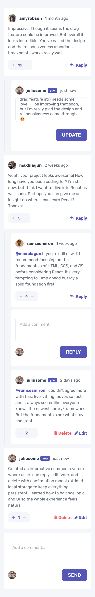
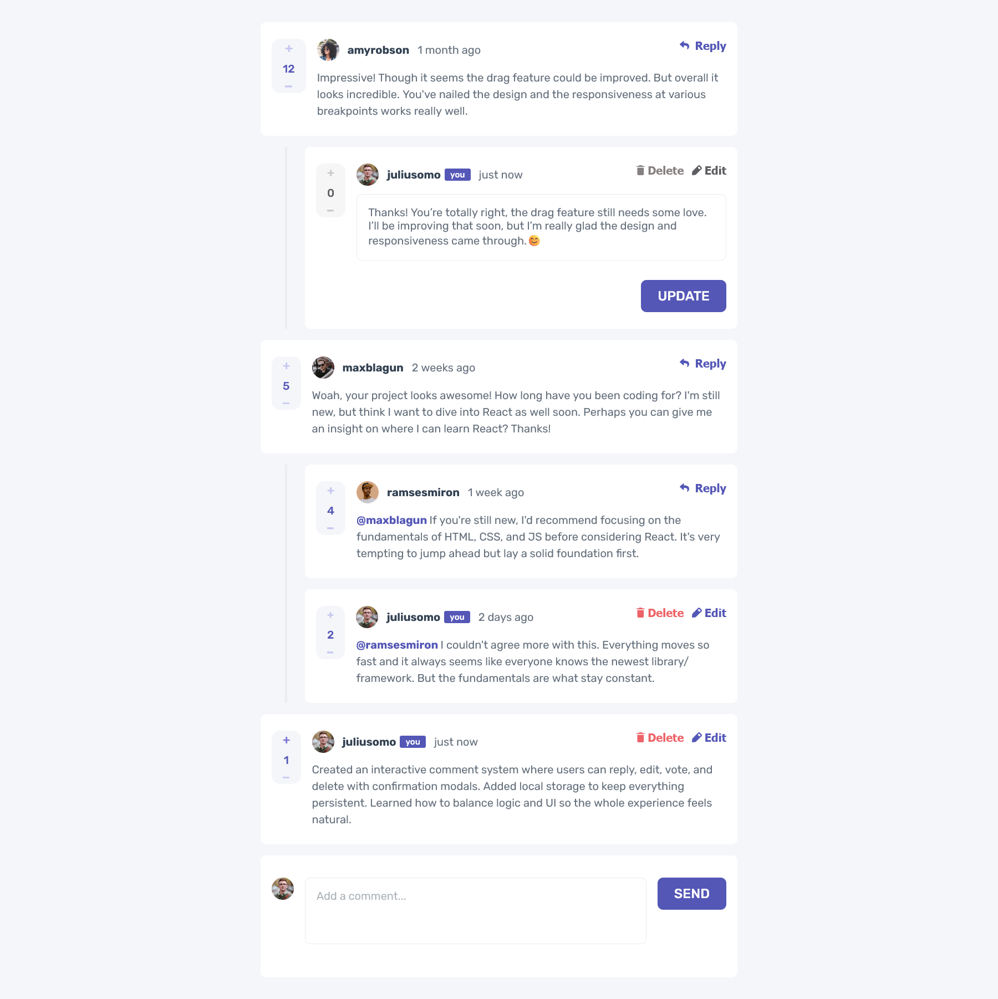

# Interactive Comments Section

An interactive comments web app built with React, featuring full CRUD functionality, voting, editing, and data persistence. This project highlights how I structure clean, scalable UI logic with reducers and manage state efficiently while focusing on user experience and design consistency.

## Table of contents

* [Overview](#overview)

  * [Features](#features)
  * [Screenshot](#screenshot)
  * [Links](#links)
* [My process](#my-process)

  * [Built with](#built-with)
  * [What I learned](#what-i-learned)
  * [Continued development](#continued-development)
* [Author](#author)

## Overview

### Features

* Create, read, update, and delete comments and replies
* Upvote and downvote system with user-based tracking
* Inline editing with prefilled textarea and auto focus
* Confirmation modal before deletion
* Persistent state using local storage
* Reducer-based logic for fast and scalable CRUD operations
* Responsive layout styled with CSS modules

### Screenshot

### Links

* Repository: [\[Add GitHub repo link here\]](https://github.com/silaskad/reactive-comments)

## My process

### Built with

* React and useReducer for predictable state management
* useRef and useEffect for controlled focus and input behavior
* Pure CSS modules for modular, maintainable styling
* Local storage for browser-based data persistence
* Clean component architecture for readability and reusability

### What I learned

This project deepened my understanding of CRUD logic and component-driven design. I learned how reducers streamline complex state updates, making the app’s logic cleaner and easier to maintain as it scales. Building modals, auto-focused inputs, and reply chains improved how I handle controlled components and UI feedback. Styling this app was also a major learning experience; it forced me to think in layers, manage responsive spacing, and bring structure to complex layouts.

### Continued development

Next, I plan to connect this project to a backend API for real database integration and authentication. I also want to expand my use of reducers for async actions and refine my UI styling approach with CSS animations or a component library for more advanced interfaces.

## Author

Created by **Silas**
[GitHub](https://github.com/silaskad)
[LinkedIn](https://www.linkedin.com/in/silas-kiwoy/)